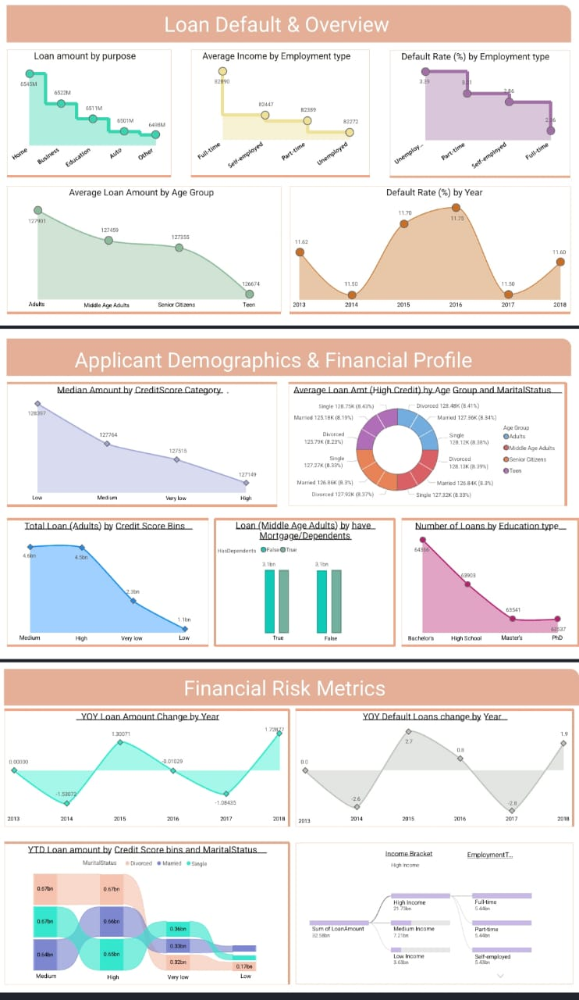

# 📊 Loan Default Analysis (Power BI Project)

This Power BI project analyzes the factors leading to loan defaults based on a fictional bank dataset. The goal is to understand customer behavior and improve loan policies.

---

## 📁 Files Included

- **Loan_Default-copy.pbix**: Power BI dashboard file.
- **Loan_default.xlsx**: Excel dataset used for analysis.
- **dashboard_preview.png**: Visual preview of the dashboard (optional).

---

## 🔍 Project Objectives

- Analyze demographic and financial patterns affecting loan defaults.
- Identify high-risk borrower profiles.
- Visualize key metrics such as:
  - Default Rate by Loan Purpose
  - Customer Credit Score Distribution
  - Loan Approval vs Rejection
  - Employment & Income Relationships

---

## 📊 Key Power BI Features Used

- Custom visuals and slicers
- Data cleaning in Power Query
- DAX measures for dynamic calculations
- Conditional formatting & tooltips

---

## 🛠️ How to Use

1. Download the `.pbix` file.
2. Open it in [Power BI Desktop](https://powerbi.microsoft.com/en-us/desktop/).
3. Ensure the dataset file (`Loan_default.xlsx`) is in the same directory.
4. If needed, refresh the data and re-link the Excel file.

---

## 📷 Screenshot

*(Optional – Replace this section with your actual image)*

---

## 📌 Skills
-  Power BI | Excel | Data Cleaning & Visualization

---

## Goal
- To Support Better lending decisions by uncovering patterns in borrower behavior.
